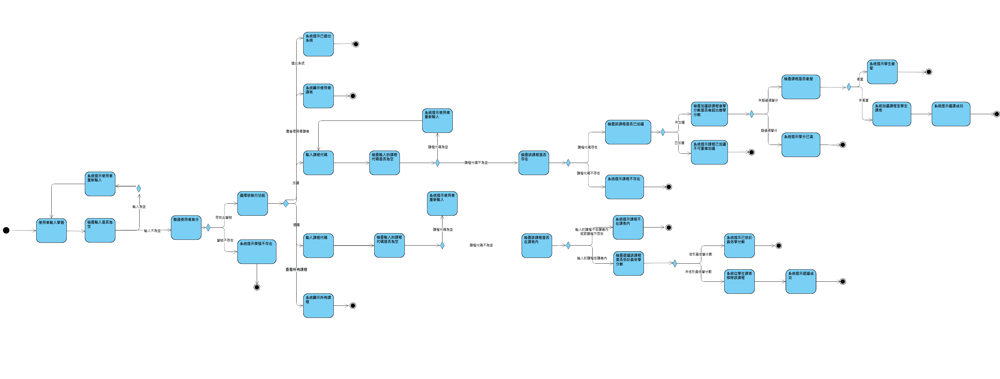

# 軟體工程開發實務 期中專題 -- 選課系統

## Usage

1. Clone 此專案

```
git clone https://github.com/icgmilk/mid_class.git
```

2. 在專案根目錄執行專案

```
python src/course_selection.py
```

## [系統需求](./docs/系統需求.md)

## [需求規格](./docs/需求規格.md)

## Robustness Diagram


## 活動圖



## 序列圖


## 分工

許鈞翔：退選, 查詢所有課程, 課程資料, 學生預設課表

吳柏宏：加選, 查詢課表, 登入系統 , 選擇功能